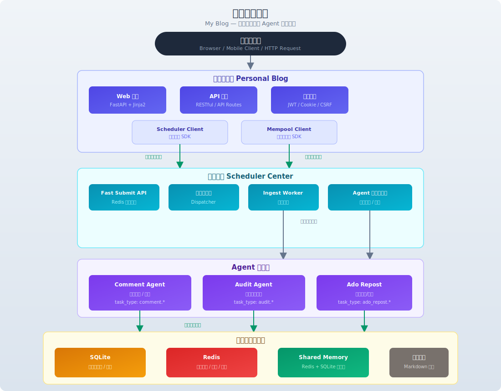

# Ado_Jk Multi-Agent Orchestration Platform

基于 **FastAPI + 调度中心 + 多 Agent** 架构的任务编排平台。

平台主服务负责前端展示与内容管理；调度中心（Scheduler Center）统一管理所有异步任务；Agent 系统负责评论审核、草稿审核、内容搬运等后台任务；Shared Memory 提供跨服务共享数据存储。

---

## 目录

- [平台页面](#平台页面)
  - [平台概览 `/`](#1-平台概览-)
  - [核心能力 `/top`](#2-核心能力-top)
  - [任务演示 `/demo`](#3-任务演示-demo)
  - [架构设计 `/architecture`](#4-架构设计-architecture)
  - [关于平台 `/about`](#5-关于平台-about)
- [技术栈](#技术栈)
- [系统架构](#系统架构)
- [核心模块](#核心模块)
  - [平台主服务](#1-平台主服务)
  - [调度中心](#2-调度中心-scheduler-center)
  - [Agent 系统](#3-agent-系统)
  - [共享记忆池](#4-共享记忆池-shared-memory-pool)
- [功能流程](#功能流程)
  - [案例审核流程](#案例审核流程)
  - [评论审核流程](#评论审核流程)
  - [内容搬运流程](#内容搬运流程)
- [快速开始](#快速开始)
  - [环境要求](#环境要求)
  - [最小启动](#最小启动)
  - [全功能启动](#全功能启动带-redis-快速投递)
- [配置说明](#配置说明)
  - [环境变量](#环境变量)
  - [API 文档](#api-文档)
- [Agent 开发](#agent-开发)
- [项目目录结构](#项目目录结构)
- [开发指南](#开发指南)
- [B2 变更清单](#b2-变更清单)

---

## 平台页面

平台提供 5 个主要页面，均通过 `index.html` 单一模板的 mode 切换渲染，由 [routers/pages.py](routers/pages.py) 路由分发，[services/page_service.py](services/page_service.py) 组装数据上下文。

### 1. 平台概览 `/`

首页展示平台定位、**6 步执行流程可视化**（任务输入 → Planner 拆解 → 依赖调度 → Agent 执行 → 结果聚合 → 共享记忆）、以及案例卡片列表。支持搜索、按月筛选、分页（每页 6 条）。

### 2. 核心能力 `/top`

平台 4 大模块的能力矩阵页面。每个模块展示：
- **模块名称**（Planner / Scheduler Center / Agent Registry / Shared Memory）
- **能力标签**（子任务拆解、状态机管理、服务注册、分布式锁等）
- **task_type 列表**（如 `plan.decompose`、`comment.moderate`、`memory.set`）
- **Agent 类型**（如 `PlannerAgent`、`Dispatcher`、`RegistryService`）
- **关联案例**（按 `Post.module_id` 优先匹配，回退按 `tech_tag`）

数据源：[CAPABILITY_MAP](services/page_service.py#L45-L70) + [PLATFORM_MODULES](services/page_service.py#L72-L101)

### 3. 任务演示 `/demo`

交互式在线体验页面，支持：
- **下拉选择任务类型**（评论审核 / 草稿审核 / 内容搬运）
- **提交后实时轮询**（每秒查询状态，展示 pending → running → succeeded 全流程）
- **Mock 降级**：Scheduler Center 不可用时自动切换为内存模拟，完整保留 task_type 和自定义 payload
- **状态展示**：logs 日志流、result 执行结果、memory_key 共享记忆键

API 端点：
| 路径 | 方法 | 说明 |
|------|------|------|
| `/api/demo/submit` | POST | 提交演示任务（JSON body: task_type, payload） |
| `/api/demo/status/{task_id}` | GET | 轮询任务状态与结果 |

实现：见 [routers/demo.py](routers/demo.py)

### 4. 架构设计 `/architecture`

展示平台的分层架构，共 6 层：
1. **接入层** — Browser / API Client
2. **平台主服务** — FastAPI Application（路由分发、Scheduler Client、CSRF 防护）
3. **调度层** — Scheduler Center（Fast Submit、Dispatcher、Ingest Worker、任务状态机）
4. **执行层** — Agent 系统（Comment Agent、Audit Agent、Ado Repost）
5. **共享层** — Shared Memory（Redis 热数据、SQLite 冷数据、分布式锁）
6. **持久化层** — Storage（SQLite、Redis、文件系统）

### 5. 关于平台 `/about`

平台介绍与团队信息，由 [build_about_page_data()](services/page_service.py) 组装上下文。

---

## 技术栈

| 层级 | 技术 | 用途 |
|------|------|------|
| **Web 框架** | FastAPI | 异步 Python Web 框架，提供 RESTful API 与模板渲染 |
| **模板引擎** | Jinja2 | 服务端模板渲染 |
| **数据库 ORM** | SQLAlchemy | 关系型数据库 ORM |
| **数据库** | SQLite | 主存储（任务、文章、评论、用户） |
| **缓存/队列** | Redis | 快速投递队列、幂等映射、共享缓存 |
| **认证鉴权** | JWT + bcrypt + CSRF | 用户认证与安全防护 |
| **消息传递** | Redis Pub/Sub | 调度中心 ingest 队列 |
| **任务调度** | 自研 Scheduler | 状态机、重试、取消、事件追溯 |
| **异步客户端** | httpx | Agent 间 HTTP 通信 |
| **部署** | Uvicorn | ASGI 服务器 |

---

## 系统架构



### 分层说明

```
用户接入层         Browser / Mobile Client
    |
    ▼
平台主服务层       Multi-Agent Orchestration Platform
    |  ├─ Web 页面（FastAPI + Jinja2）
    |  ├─ API 接口（RESTful）
    |  ├─ 认证鉴权（JWT / Cookie / CSRF）
    |  └─ Scheduler Client + Mempool Client
    |
    ├──→ 投递异步任务 ──→  调度中心 Scheduler Center
    |                       ├─ Fast Submit API（Redis 投递）
    |                       ├─ Dispatcher（路由与调度）
    |                       ├─ Ingest Worker（异步落库）
    |                       └─ Agent Registry（注册与发现）
    |                              │
    |                              ├──→ Comment Agent（评论审核）
    |                              ├──→ Audit Agent（草稿审核）
    |                              └──→ Ado Repost（内容搬运）
    |
    └──→ 读写共享数据 ──→  共享记忆池 Shared Memory
                            ├─ Redis（热数据）
                            └─ SQLite（冷数据）
                                      │
    持久化层                SQLite（主库） Redis（缓存）  文件系统（Markdown）
```

### 组件交互关系

1. **平台主服务 → 调度中心**：用户操作（写草稿、发表评论、触发搬运）后，主服务通过 Scheduler Client SDK 将任务投递给调度中心
2. **调度中心 → Agent**：Dispatcher 从队列拉取任务，按 `task_type` 路由到对应 Agent 的 `/api/internal/agent/run` 接口
3. **调度中心 ←→ 数据层**：
   - 普通模式：直接写 SQLite
   - Fast Submit 模式：先写 Redis 队列 → Ingest Worker 异步落库 SQLite
4. **Agent → Shared Memory**：Agent 执行任务过程中通过 Shared Memory SDK 读写中间结果、幂等锁、缓存数据

---

## 核心模块

### 1. 平台主服务

#### 功能清单

| 模块 | 功能 | 入口 |
|------|------|------|
| **用户系统** | 注册、登录、JWT 令牌管理、Cookie 鉴权 | `security.py`, `routers/auth_routes.py` |
| **文章管理** | 发布、编辑、删除 Markdown 文章，列表与详情展示 | `routers/pages.py`, `routers/posts.py` |
| **评论系统** | 发表评论、评论列表、异步审核 | `routers/comments.py` |
| **草稿审核** | 草稿创建后自动投递审核任务 | `routers/agent.py` |
| **内部任务** | 触发内容搬运等后台任务 | `routers/internal_tasks.py` |
| **调度客户端** | 封装与调度中心的通信 | `scheduler_client.py` |
| **记忆池客户端** | 封装共享记忆池 SDK 调用 | `core/mempool.py` |

#### 关键 API

| 路径 | 方法 | 说明 |
|------|------|------|
| `/` | GET | 平台概览 |
| `/api/v1/posts/{id}` | GET | 文章详情 |
| `/api/v1/posts/{id}/like` | POST | 点赞 |
| `/api/auth/login` | POST | 登录 |
| `/api/auth/register` | POST | 注册 |
| `/api/agent/draft` | POST | 创建草稿并投递审核 |
| `/api/internal/trigger-ado-repost` | POST | 触发内容搬运 |

---

### 2. 调度中心 Scheduler Center

独立服务，统一管理所有异步任务的提交、调度、执行、重试和事件追溯。

#### 核心组件

| 组件 | 说明 |
|------|------|
| **Fast Submit API** | `POST /api/internal/scheduler/tasks` — 接收任务，支持 Redis 快速投递和普通模式 |
| **Dispatcher** | 从 SQLite/Redis 拉取 PENDING 任务，按 `task_type` 路由到 Agent，管理并发、重试、超时、取消 |
| **Ingest Worker** | 仅 Fast Submit 模式下启用，从 Redis 队列 `BRPOP` 消费任务并落库 SQLite |
| **Agent Registry** | Agent 注册表，支持按 `task_type` 查找可用 Agent，健康检查缓存与心跳管理 |
| **任务状态机** | PENDING → (RUNNING → SUCCEEDED / FAILED / CANCELED)，含重试机制 |

#### 调度中心 API

| 路径 | 方法 | 说明 |
|------|------|------|
| `/api/internal/scheduler/tasks` | POST | 提交任务（支持幂等） |
| `/api/internal/scheduler/tasks` | GET | 任务列表（支持过滤分页） |
| `/api/internal/scheduler/tasks/{id}` | GET | 任务详情 |
| `/api/internal/scheduler/tasks/{id}/logs` | GET | 任务日志 |
| `/api/internal/scheduler/tasks/{id}/cancel` | POST | 取消任务 |
| `/api/internal/scheduler/agents/register` | POST | 注册 Agent |
| `/api/internal/scheduler/agents` | GET | Agent 列表 |
| `/health` | GET | 健康检查 |
| `/ready` | GET | 就绪检查 |

#### 两种提交模式对比

| 特性 | 普通模式 | Fast Submit 模式 |
|------|----------|-----------------|
| 响应延迟 | ~50-200ms（同步写 SQLite） | ~5-20ms（写 Redis） |
| 启用条件 | 默认 | `SCHEDULER_FAST_SUBMIT_ENABLED=true` + Redis |
| 落库时机 | 同步写入 | Ingest Worker 异步写入 |
| 幂等支持 | DB 唯一约束 | Redis 幂等映射 |
| 适用场景 | 低并发、开发环境 | 高并发、生产环境 |

---

### 3. Agent 系统

每个 Agent 是一个独立的 FastAPI 服务，通过统一的 `/api/internal/agent/run` 接口接收调度中心分发的任务。

| Agent | 职责 | 监听端口 | task_type |
|-------|------|----------|-----------|
| **Comment Agent** | 评论内容审核、自动回复 | 8020 | `comment.moderate` |
| **Audit Agent** | 草稿内容审核（LLM 驱动） | — | `audit.draft` |
| **Ado Repost** | 社交媒体内容搬运 | 8030 | `ado_repost.run` |

所有 Agent 遵循相同的接入规范：
- 实现 `/api/internal/agent/run` 接口（内部 token 鉴权）
- 启动时可选自动向调度中心注册
- 通过 Shared Memory SDK 读写跨服务共享数据

---

### 4. 共享记忆池 Shared Memory Pool

独立 Python 包，提供跨服务的统一存储接口。详见 [shared_mempool 文档](https://github.com/duxiaokk/my_blog/tree/main/shared_mempool)。

#### 存储后端

| 后端 | 用途 | 特点 |
|------|------|------|
| **Redis** | 热数据、分布式场景 | 高性能、TTL 自动过期 |
| **SQLite** | 冷数据、单机场景 | 无外部依赖、持久可靠 |

#### 核心 API

```python
from shared_memory import Mempool

pool = Mempool(backend="redis", url="redis://127.0.0.1:6379/0")

# 写入
pool.set("my_key", {"data": "value"}, ttl_seconds=3600)

# 读取
data = pool.get("my_key")

# 删除
pool.delete("my_key")

# 分布式锁
with pool.lock("resource_name", ttl_seconds=10):
    # 临界区
    pass
```

---

## 功能流程

### 案例审核流程

```
用户创建草稿 → 平台主服务
    |
    ├─ 草稿落库 SQLite
    ├─ 写 shared_memory: agent_draft:audit:{draft_id}
    ├─ 投递任务 task_type=audit.draft → Scheduler Center
    |
    ▼
Scheduler Center
    ├─ [Fast Submit] 写 Redis → Ingest Worker 异步落库
    └─ Dispatcher 路由到 Audit Agent
            │
            ▼
    Audit Agent (/api/internal/agent/run)
            ├─ 读取 markdown 文件
            ├─ 调用 LLM 审核
            └─ 结果写入 shared_memory: audit:draft:{draft_id}
```

### 评论审核流程

```
用户发表评论 → 平台主服务
    ├─ 评论落库
    └─ BackgroundTasks 异步投递
        task_type=comment.moderate → Scheduler Center
            │
            ▼
    Comment Agent 审核评论后写入 shared_memory
```

### 内容搬运流程

```
内部触发 → 平台主服务 POST /api/internal/trigger-ado-repost
    └─ task_type=ado_repost.run → Scheduler Center
            │
            ▼
    Ado Repost Agent
        ├─ 从社交媒体抓取内容
        ├─ shared_memory 幂等锁防重复
        └─ 结果写入 shared_memory 缓存
```

---

## 快速开始

### 环境要求

- Python >= 3.11
- Redis >= 5.0（可选，Fast Submit 模式需要）
- pip 或 poetry

### 最小启动

只需启动调度中心和平台主服务两个进程。

```bash
# 终端 1：启动调度中心
cd "Personal Blog"
$env:SCHEDULER_INTERNAL_TOKEN="local-dev-scheduler-token"
$env:SCHEDULER_AGENT_ENDPOINTS="http://127.0.0.1:8020"
uvicorn scheduler_center.main:app --host 127.0.0.1 --port 8010

# 终端 2：启动平台主服务
cd "Personal Blog"
uvicorn main:app --host 127.0.0.1 --port 8000
```

然后访问 [http://127.0.0.1:8000](http://127.0.0.1:8000)。

### 全功能启动（带 Redis 快速投递）

需要先确保本机 Redis 已运行（`redis-cli PING` 返回 `PONG`）。

```bash
# 终端 1：Scheduler API（4 workers，禁用内置 dispatcher）
cd "Personal Blog"
$env:SCHEDULER_DISABLE_DISPATCHER="true"
$env:SCHEDULER_REDIS_URL="redis://127.0.0.1:6379/0"
$env:SCHEDULER_FAST_SUBMIT_ENABLED="true"
uvicorn scheduler_center.main:app --host 127.0.0.1 --port 8010 --workers 4

# 终端 2：Ingest Worker（Redis -> SQLite 异步落库）
cd "Personal Blog"
$env:SCHEDULER_REDIS_URL="redis://127.0.0.1:6379/0"
$env:SCHEDULER_FAST_SUBMIT_ENABLED="true"
python -m scheduler_center.ingest_worker

# 终端 3：Dispatcher Worker（独立调度进程）
cd "Personal Blog"
$env:SCHEDULER_AGENT_ENDPOINTS="http://127.0.0.1:8020"
$env:SCHEDULER_AGENT_TOKEN="local-dev-scheduler-token"
python -m scheduler_center.worker

# 终端 4：Comment Agent
cd "../Comment_Agent"
$env:SCHEDULER_INTERNAL_TOKEN="local-dev-scheduler-token"
uvicorn app.main:app --host 127.0.0.1 --port 8020

# 终端 5：平台主服务
cd "Personal Blog"
uvicorn main:app --host 127.0.0.1 --port 8000
```

---

## 配置说明

### 环境变量

#### 平台主服务

| 变量 | 默认值 | 说明 |
|------|--------|------|
| `DATABASE_URL` | `sqlite:///./blog.db` | 数据库连接 |
| `SCHEDULER_INTERNAL_TOKEN` | `local-dev-scheduler-token` | 调度中心内部认证 token |
| `SCHEDULER_CENTER_URL` | `http://127.0.0.1:8010` | 调度中心地址 |
| `SCHEDULER_SUBMIT_TIMEOUT` | `10.0` | 任务提交超时（秒） |
| `MEMPOOL_REDIS_URL` | `redis://127.0.0.1:6379/0` | 共享记忆池 Redis 地址 |
| `MEMPOOL_REDIS_NAMESPACE` | `blog_mempool` | 共享记忆池命名空间 |
| `JWT_SECRET_KEY` | `your-secret-key` | JWT 签名密钥 |
| `ACCESS_TOKEN_EXPIRE_MINUTES` | `30` | 访问令牌过期时间 |

#### 调度中心

| 变量 | 默认值 | 说明 |
|------|--------|------|
| `SCHEDULER_DB_PATH` | `scheduler.db` | SQLite 数据库路径 |
| `SCHEDULER_REDIS_URL` | ---- | Redis 连接 URL |
| `SCHEDULER_REDIS_PREFIX` | `scheduler` | Redis key 前缀 |
| `SCHEDULER_FAST_SUBMIT_ENABLED` | `false` | 启用 Redis 快速投递 |
| `SCHEDULER_DISABLE_DISPATCHER` | `false` | 禁用内置调度器 |
| `SCHEDULER_AGENT_ENDPOINTS` | ---- | Agent 地址列表（逗号分隔） |
| `SCHEDULER_AGENT_TOKEN` | ---- | Agent 认证 token |
| `SCHEDULER_MAX_CONCURRENCY` | `10` | 最大并发执行数 |
| `SCHEDULER_DB_POOL_SIZE` | `20` | 数据库连接池大小 |
| `SCHEDULER_DB_MAX_OVERFLOW` | `40` | 连接池最大溢出 |

### API 文档

服务启动后可访问以下文档地址：

| 服务 | Swagger UI | ReDoc |
|------|-----------|-------|
| 平台主服务 | `http://127.0.0.1:8000/docs` | `http://127.0.0.1:8000/redoc` |
| 调度中心 | `http://127.0.0.1:8010/docs` | `http://127.0.0.1:8010/redoc` |
| Comment Agent | `http://127.0.0.1:8020/docs` | `http://127.0.0.1:8020/redoc` |

---

## Agent 开发

要新增一个 Agent 接入调度中心，请参考 [Agent 接入模板](scheduler_center/AGENT_TEMPLATE.md)。

### 最小接入示例

```python
# my_agent/server.py
from fastapi import FastAPI, Request, HTTPException
from pydantic import BaseModel

app = FastAPI()
INTERNAL_TOKEN = "my-token"

class AgentRunRequest(BaseModel):
    task_id: str
    task_type: str
    payload: dict

@app.post("/api/internal/agent/run")
async def run(request: Request, body: AgentRunRequest):
    # 鉴权
    auth = request.headers.get("Authorization", "")
    if auth != f"Bearer {INTERNAL_TOKEN}":
        raise HTTPException(401)

    # 执行业务逻辑
    result = execute_task(body.task_type, body.payload)

    return {"status": "succeeded", "result": result}
```

启动后向调度中心的 `POST /api/internal/scheduler/agents/register` 注册即可。

---

## 项目目录结构

```
Personal Blog/
├── main.py                          # 平台主服务入口
├── models.py                        # SQLAlchemy 数据模型（含平台语义字段）
├── database.py                      # 数据库引擎
├── scheduler_client.py              # 调度中心客户端 SDK
├── security.py                      # 加密认证
├── scheduler_center/                # 调度中心
│   ├── main.py                      # 调度中心入口
│   ├── router.py                    # API 路由
│   ├── dispatcher.py                # 任务调度与分发
│   ├── worker.py                    # 独立调度进程入口
│   ├── ingest_worker.py             # Redis 异步落库进程
│   ├── redis_queue.py               # Redis 队列封装
│   ├── models.py                    # SQLAlchemy 模型
│   ├── schemas.py                   # Pydantic 模型
│   ├── database.py                  # 数据库引擎
│   ├── config.py                    # 配置
│   ├── scripts/
│   │   ├── load_test.py             # 压测脚本
│   │   └── fault_drill.py           # 故障演练脚本
│   ├── docs/                        # 调度中心文档
│   └── AGENT_TEMPLATE.md            # Agent 接入模板
├── routers/                         # 路由模块
│   ├── agent.py                     # 草稿/审核相关
│   ├── auth_routes.py               # 认证
│   ├── comments.py                  # 评论
│   ├── demo.py                      # ★ 演示任务 API (新增)
│   ├── internal_tasks.py            # 内部任务
│   ├── pages.py                     # ★ 页面渲染 (含 /demo /architecture)
│   └── posts.py                     # 案例 API
├── core/                            # 核心模块
│   ├── config.py                    # 配置
│   └── mempool.py                   # 共享记忆池客户端
├── services/                        # 业务逻辑层
│   ├── page_service.py              # ★ 页面数据组装 (含 CAPABILITY_MAP)
│   ├── ai_services.py               # AI 服务
│   ├── agent_service.py             # Agent 服务
│   ├── agent_prompts.py             # Agent 提示词
│   └── ...
├── templates/                       # Jinja2 模板
│   ├── index.html                   # ★ 主模板 (多 mode 渲染)
│   ├── base.html                    # 导航布局
│   ├── detail.html                  # 案例详情
│   ├── create.html                  # 发布案例
│   ├── login.html                   # 登录
│   └── agent_demo.html              # Agent 演示
├── tests/
│   └── test_agent_integration.py    # ★ 集成测试 (14 条)
├── schemas/                         # Pydantic 模型
├── add_platform_fields.py           # 数据库迁移脚本
├── docs/
│   └── imgs/                        # 文档图片
├── requirements.txt
├── pyproject.toml
└── README.md
```

---

## 开发指南

### 运行测试

```bash
cd "Personal Blog"
pytest tests/test_agent_integration.py -v   # 14 条测试（页面访问 + API + 模型）
```

测试覆盖：
| 类别 | 测试数量 | 覆盖内容 |
|------|---------|----------|
| AI 端点 | 5 | outline / polish / analyze / recommend / draft |
| 页面访问 | 3 | /architecture / /demo / /top |
| 能力展示 | 1 | /top 页 task_type / Agent 信息 |
| 演示 API | 4 | submit mock / status polling / task_type 透传 / payload 透传 |
| 数据模型 | 1 | Post 平台语义字段持久化 |

### 运行压测

```bash
cd "Personal Blog"
python scheduler_center/scripts/load_test.py \
    --scheduler-url http://127.0.0.1:8010 \
    --token local-dev-scheduler-token \
    --concurrency 100 \
    --total 200 \
    --task-type comment.moderate
```

### 运行故障演练

```bash
cd "Personal Blog"
python scheduler_center/scripts/fault_drill.py \
    --scheduler-url http://127.0.0.1:8010 \
    --token local-dev-scheduler-token \
    --drill-type network_timeout
```

### 代码规范

- 遵循 PEP 8
- 使用 `from __future__ import annotations` 启用延迟注解
- Type hints 全覆盖
- FastAPI `lifespan` 管理应用生命周期（替代弃用的 `on_event`）
- httpx 调用禁用系统代理：`trust_env=False`

---

## B2 变更清单

> **B2 阶段**：从"个人博客"改造为"Ado_Jk Multi-Agent Orchestration Platform"。

### 新增文件

| 文件 | 说明 |
|------|------|
| `routers/demo.py` | 演示任务 API（submit + status polling），含 Pydantic schema (`DemoSubmitRequest`) 和 mock 降级 |
| `add_platform_fields.py` | 数据库迁移脚本，为 posts 表添加 module_id / scenario_type / task_type 列 |

### 修改文件（18 个）

| 文件 | 变更概要 |
|------|----------|
| `templates/base.html` | 导航重构：平台概览 / 核心能力 / 任务演示 / 架构设计 / 关于平台；按钮"发布文章"→"发布案例" |
| `templates/index.html` | +591/-176 行：新增 architecture / demo / top mode 渲染；首页执行流程 6 步可视化；demo 交互表单 + JS 轮询 |
| `templates/login.html` | 主标题 "Login to the blog" → "登录平台" |
| `templates/create.html` | "AI 写作助手" → "AI 编排智能体" |
| `templates/agent_demo.html` | 重写为多 Agent 任务编排演示 |
| `services/page_service.py` | 新增 CAPABILITY_MAP、PLATFORM_MODULES；build_top_page_data 按 module_id 匹配；新增 build_demo_page_data；build_architecture_page_data 修复 avatar |
| `routers/pages.py` | 新增 /demo 和 /architecture 路由 |
| `models.py` | Post 新增 module_id / scenario_type / task_type 字段 |
| `main.py` | 注册 demo 路由 |
| `schemas/ai.py` | 默认风格 "技术博客" → "技术文章" |
| `services/agent_prompts.py` | 系统提示词改为多 Agent 编排 |
| `services/agent_service.py` | 文案 "文章" → "案例" |
| `services/agent_tools.py` | 清洁残余博客文本 |
| `services/ai_services.py` | 草稿生成 "文章" → "案例" |
| `services/cache.py` | 清洁残余博客文本 |
| `tests/test_agent_integration.py` | +9 条测试：页面访问 (3) + API 逻辑 (4) + 字段持久化 (1) + 能力展示 (1) |
| `AGENTS.md` | 平台品牌更新 |
| `README.md` | 全面重写：新增平台页面章节 + B2 变更清单 + 目录结构更新 |

### 数据库变更

```sql
-- posts 表新增平台语义字段
ALTER TABLE posts ADD COLUMN module_id VARCHAR(64);
ALTER TABLE posts ADD COLUMN scenario_type VARCHAR(64);
ALTER TABLE posts ADD COLUMN task_type VARCHAR(128);
CREATE INDEX IF NOT EXISTS ix_posts_module_id ON posts (module_id);
```

### 测试结果

```
tests/test_agent_integration.py ..............  14 passed in ~12s
```

---

## License

MIT
