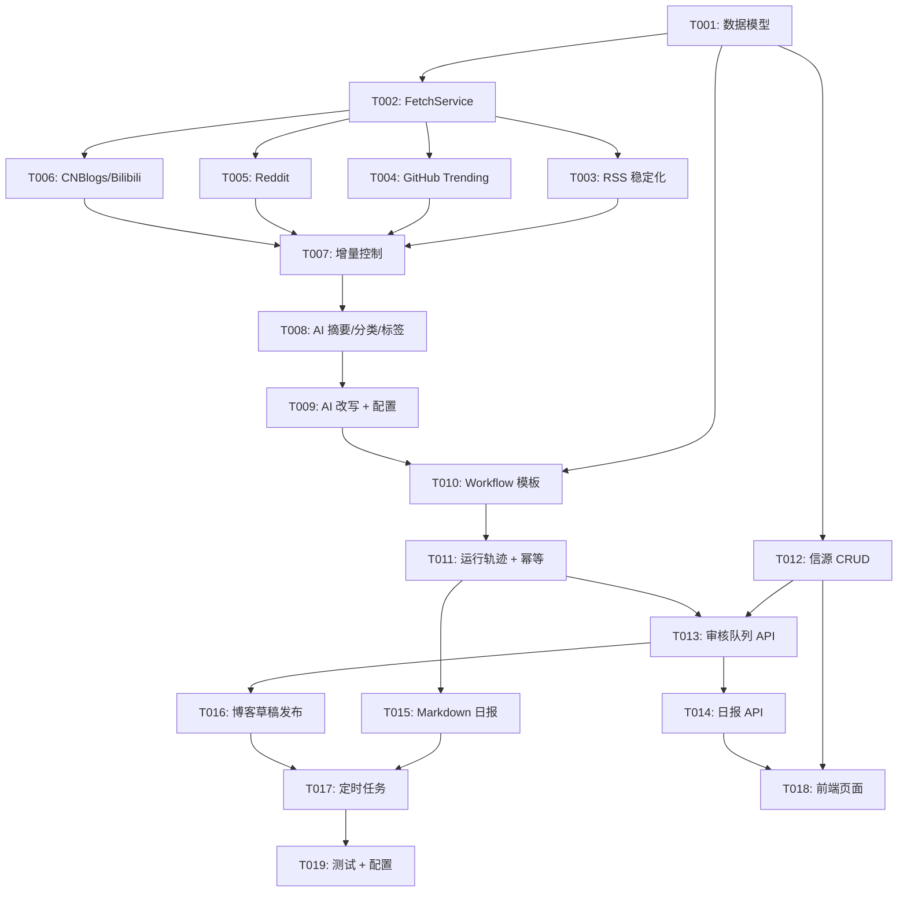

# Content Hub MVP - Codex Board

> 总进度看板 · 19 个任务 · 按推荐开发顺序排列

---

## 整体进度

| 完成 | 总计 | 进度 |
|------|------|------|
| 3 | 19 | 16% |

---

## Phase 1: 数据模型 (1 task)

| 编号 | 任务 | 状态 | 模块 |
|------|------|------|------|
| [T001](tasks/T001_db_migration_batch1.md) | db_migration_batch1 - 数据模型扩展 | DONE | DB |

---

## Phase 2: Fetcher Engine (6 tasks)

| 编号 | 任务 | 状态 | 模块 |
|------|------|------|------|
| [T002](tasks/T002_fetch_service_unified.md) | fetch_service_unified - 统一入口 FetchService | DONE | fetcher_engine |
| [T003](tasks/T003_rss_fetcher_stable.md) | rss_fetcher_stable - RSS 抓取器稳定化 | DONE | fetcher_engine |
| [T004](tasks/T004_github_trending_fetcher.md) | github_trending_fetcher - GitHub Trending | IN PROGRESS | fetcher_engine |
| [T005](tasks/T005_reddit_fetcher.md) | reddit_fetcher - Reddit 抓取器 | TODO | fetcher_engine |
| [T006](tasks/T006_cnblogs_bilibili_fields.md) | cnblogs_bilibili_fields - CNBlogs/Bilibili 字段补齐 | TODO | fetcher_engine |
| [T007](tasks/T007_incremental_cursor.md) | incremental_cursor - 增量控制 + 失败容错 | TODO | fetcher_engine |

---

## Phase 3: AI Processor (2 tasks)

| 编号 | 任务 | 状态 | 模块 |
|------|------|------|------|
| [T008](tasks/T008_ai_summarize_classify_tag.md) | ai_summarize_classify_tag - 摘要/分类/标签 | TODO | ai_processor |
| [T009](tasks/T009_ai_rewrite_config.md) | ai_rewrite_config - 改写处理器 + 统一配置 | TODO | ai_processor |

---

## Phase 4: Workflow Engine (2 tasks)

| 编号 | 任务 | 状态 | 模块 |
|------|------|------|------|
| [T010](tasks/T010_workflow_radar_template.md) | workflow_radar_template - radar_pipeline 节点定义 | TODO | workflow_engine |
| [T011](tasks/T011_workflow_trace_idempotency.md) | workflow_trace_idempotency - 运行轨迹 + 幂等控制 | TODO | workflow_engine |

---

## Phase 5: Platform API (3 tasks)

| 编号 | 任务 | 状态 | 模块 |
|------|------|------|------|
| [T012](tasks/T012_platform_source_api.md) | platform_source_api - 信源管理 CRUD API | TODO | platform |
| [T013](tasks/T013_platform_review_api.md) | platform_review_api - 审核队列 API | TODO | platform |
| [T014](tasks/T014_platform_digest_api.md) | platform_digest_api - 日报 API | TODO | platform |

---

## Phase 6: Publisher Engine (2 tasks)

| 编号 | 任务 | 状态 | 模块 |
|------|------|------|------|
| [T015](tasks/T015_publisher_markdown.md) | publisher_markdown - Markdown 日报生成器 | TODO | publisher_engine |
| [T016](tasks/T016_publisher_blog_draft.md) | publisher_blog_draft - 博客草稿发布 + 发布记录 | TODO | publisher_engine |

---

## Phase 7: Scheduler + Frontend + Tests (3 tasks)

| 编号 | 任务 | 状态 | 模块 |
|------|------|------|------|
| [T017](tasks/T017_scheduler_cron.md) | scheduler_cron - 定时任务配置 | TODO | scheduler_center |
| [T018](tasks/T018_frontend_minimal_pages.md) | frontend_minimal_pages - 前端最小页面 | TODO | frontend |
| [T019](tasks/T019_tests_and_config.md) | tests_and_config - 测试 + 配置整理 | TODO | tests |

---

## 任务依赖图

---

## 里程碑验收

| 里程碑 | 涉及任务 | 验收标准 |
|--------|----------|----------|
| M1: 抓取闭环 | T001~T007 | 可配置至少 3 个信源；抓取结果统一入库；支持去重和关键词过滤 |
| M2: AI 处理闭环 | T008~T009 | 可生成摘要；可生成中文改写稿；处理失败有明确降级 |
| M3: 审核闭环 | T010~T013 | 控制台可查看待审核内容；可通过/驳回/归档；可编辑最终稿 |
| M4: 发布闭环 | T014~T016 | 审核通过后可生成博客草稿；可生成日报 Markdown；可查看发布结果记录 |
| M5: 调度闭环 | T017~T019 | 每天 09:00 自动运行；可查看运行状态和错误信息；重跑不重复发布 |

---

*最后更新：2026-06-11*
## Notes

- 2026-06-11: T001 revalidated. Alembic `upgrade` / `downgrade` passes on a clean temp SQLite database.
- 2026-06-11: Default workspace SQLite files under `apps/platform/*.db` still raise `disk I/O error`; keep T001 as `DONE`, but this local database file issue still needs environment cleanup or file replacement.

*?????2026-06-11*
