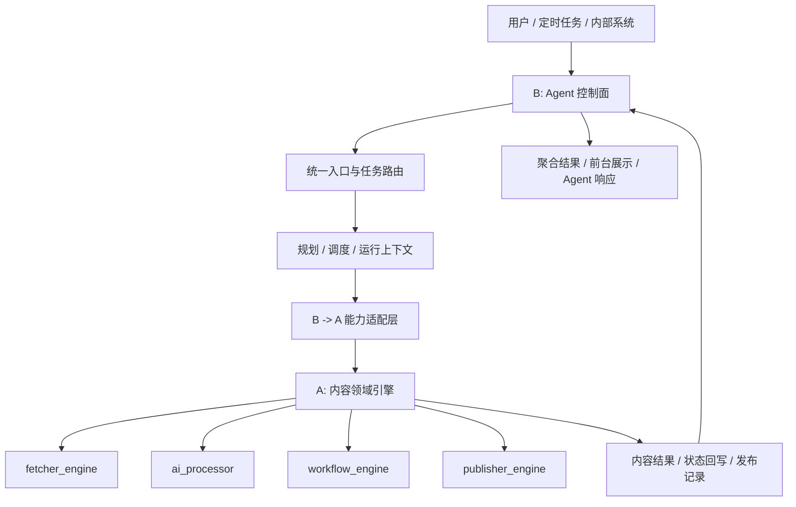

# Agent 控制面迁移清单

## 背景与目标
- 产品定位固定为：一个面向内容情报与内容生产的 Agent 化产品。
- 系统关系固定为：`A = 内容领域引擎`，`B = Agent 控制面`。
- 本次迁移只调整“编排权”和“入口权”，不追求把内容核心实现整体搬到 B。
- 迁移目标是形成稳定分层：`B 统一入口与编排`，`A 专注内容执行`。

## 非目标
- 不重写 `fetcher_engine`、`ai_processor`、`publisher_engine` 的核心实现。
- 不在迁移过程中顺手修改内容数据模型、审核规则、发布规则。
- 不引入新的基础设施或额外插件系统。
- 不追求一步到位删除所有旧链路，允许保留短期兼容层。

## 迁移原则
1. A 持续负责内容采集、内容处理、审核准备、摘要聚合、发布执行、状态回写。
2. B 统一负责用户入口、系统入口、定时入口、任务编排、Agent 控制、工具调用、运行上下文。
3. B 不直接依赖 A 的内部实现细节，统一通过能力适配层调用。
4. 旧编排链路只做兼容，不再继续扩展。
5. 先收口入口，再抽能力接口，最后清理遗留双轨。

## 当前问题
1. 内容执行链路已经完整，但入口分散在 `platform`、`scheduler_center`、`workflow_engine` 多处。
2. `platform` 同时承载 Agent、调度、内部任务入口和旧 orchestration 逻辑，控制职责偏重。
3. 内容链路与编排链路之间缺少稳定适配层，容易产生跨层直连。
4. 旧 `orchestration_engine` 与新的 `workflow_engine + scheduler_center` 存在双轨倾向，后续会放大维护成本。
5. 当前主要矛盾不是“内容功能不够”，而是“谁负责入口、谁负责调度、谁负责决策”不够清晰。

## 目标态架构

## A / B 边界定义

### A：内容领域引擎
- 负责内容能力本身，包括抓取、过滤、摘要、分类、改写、审核准备、发布。
- 负责内容主数据、状态流转、幂等控制、领域规则。
- 对外暴露稳定能力接口，不暴露内部模块耦合细节。

### B：Agent 控制面
- 负责统一入口、任务编排、调度分发、运行跟踪、Agent 协作、工具调用、结果聚合。
- 负责决定“何时调用什么能力、以什么策略调用、失败后如何恢复”。
- 不负责内容处理实现细节，不直接改写内容领域状态机。

## 范围内 / 范围外

### 范围内
- 统一外部入口、内部入口、定时入口到 B。
- 新增 `B -> A` 能力适配层。
- 收敛 `radar`、`digest`、`publish` 等编排调用路径。
- 逐步降级旧 `orchestration_engine`、`planner_service`、`aggregator_service`。

### 范围外
- 大规模迁移内容域目录。
- 重写 fetcher / processor / publisher 的具体实现。
- 调整内容表结构或引入新的任务存储模型。
- 对前端交互做大改版。

## 模块迁移清单

| 路径 | 当前定位 | 目标归属 | 动作 | 完成标志 | 依赖 | 风险等级 |
|------|------|------|------|------|------|------|
| `apps/fetcher_engine` | 内容采集实现 | A | 保留 | 仅通过标准能力接口被调用 | 适配层 contract | 低 |
| `apps/ai_processor` | 内容处理实现 | A | 保留 | 统一从领域服务入口暴露处理能力 | 适配层 contract | 低 |
| `apps/publisher_engine` | 内容发布实现 | A | 保留 | 发布链路仅作为 A 的能力被触发 | 适配层 contract | 低 |
| `apps/workflow_engine/registry` | 内容能力注册 | A | 保留 | 平台层不再直接依赖具体插件细节 | 无 | 低 |
| `apps/workflow_engine/runtime` | 内容状态读写 | A | 保留 | 对外只暴露服务接口，不暴露内部存取逻辑 | service 边界整理 | 中 |
| `apps/workflow_engine/pipeline` | 领域执行器 | A | 保留 | 继续承担执行器职责，但不再作为产品级入口 | service 边界整理 | 中 |
| `apps/workflow_engine/api/service.py` | 内容工作流服务 | A | 改造后保留 | 对外形成稳定的领域服务方法和 DTO | 适配层 | 中 |
| `apps/platform/agents` | Agent 实现层 | B | 保留并强化 | 新编排能力优先落在该目录 | 统一任务入口 | 低 |
| `apps/platform/scheduler_center/dispatcher.py` | 调度分发 | B | 保留 | 成为统一任务分发入口，不直接跨层调用 A 内部细节 | 适配层 | 低 |
| `apps/platform/scheduler_center/orchestration_router.py` | 编排入口 | B | 保留并收口 | 外部编排请求统一进该层 | 路由梳理 | 低 |
| `apps/platform/routers/internal_tasks.py` | 内部任务入口 | B | 保留并收口 | 内部触发统一走标准任务接口 | 路由梳理 | 中 |
| `apps/platform/core/mempool.py` | 共享状态基础设施 | B | 保留 | 继续只承担运行上下文，不承载内容领域逻辑 | 无 | 低 |
| `apps/platform/scheduler_center/orchestration_engine.py` | 旧编排运行时 | 兼容层 | 冻结并逐步退场 | 不再新增功能，仅保留兼容转发 | 新编排链路完成 | 高 |
| `apps/platform/services/planner_service.py` | 旧规划服务 | 兼容层 | 逐步收敛 | 新规划能力优先走 `planner_agent` | 入口统一 | 中 |
| `apps/platform/services/aggregator_service.py` | 旧聚合服务 | 兼容层 | 逐步收敛 | 新聚合能力优先走 `aggregator_agent` | 入口统一 | 中 |

## 需要从 A 抽给 B 的标准能力

| 标准能力 | 当前落点 | 目标形式 | 完成定义 |
|------|------|------|------|
| `collect_content` | `apps/fetcher_engine` | 领域能力接口 | B 不再感知 fetcher 名称和具体注册细节 |
| `filter_content` | `apps/workflow_engine/pipeline/filter_node.py` | 领域能力接口 | 过滤逻辑继续留在 A，由 B 传策略参数 |
| `process_content` | `apps/ai_processor` | 领域能力接口 | 摘要、分类、改写由统一入口暴露 |
| `prepare_review` | `apps/workflow_engine/api/service.py` | 领域能力接口 | B 只触发审核准备，不直连内部步骤 |
| `generate_digest` | `apps/publisher_engine` + `apps/workflow_engine` | 领域能力接口 | digest 生成由 A 统一封装 |
| `publish_content` | `apps/publisher_engine` | 领域能力接口 | 发布幂等和平台规则继续由 A 持有 |

## 关键模块处理建议

### `run_radar_pipeline`
- 当前位置：`apps/workflow_engine/api/service.py`
- 建议处理：保留在 A，对外收敛为 `run_content_radar(payload)`。
- 完成定义：B 只调用领域接口，不再直接感知 `workflow_engine` 内部编排细节。

### `linear_pipeline.py` / `dag_pipeline.py`
- 当前位置：`apps/workflow_engine/pipeline/`
- 建议处理：继续保留在 A，作为领域执行器存在。
- 完成定义：不再直接承担产品级入口职责，只作为领域服务内部实现。

### `FilterNode`
- 当前位置：`apps/workflow_engine/pipeline/filter_node.py`
- 建议处理：保留在 A。
- 完成定义：过滤规则依旧属于内容领域规则，由 B 传参但不接管实现。

## 新增边界层设计

### 模块建议
- `apps/platform/services/content_domain_client.py`
或
- `apps/platform/services/content_capability_service.py`

### 职责
- 作为 `B -> A` 的唯一适配层。
- 屏蔽 `workflow_engine` 内部结构。
- 统一 DTO、能力 contract、错误语义、调用约定。
- 为后续 A 内部重构提供隔离带。

### 建议首批接口
- `run_content_radar(payload)`
- `run_daily_digest(payload)`
- `prepare_review_items(payload)`
- `publish_approved_content(payload)`

### DTO 建议
- 请求 DTO 只表达业务意图，不暴露内部模块名。
- 响应 DTO 统一包含：`run_id`、`status`、`summary`、`errors`、`trace_ref`。
- 异常语义统一为“可定位、可记录、可重试”。

## 分阶段实施计划

### M01 统一入口收口
- 目标：将用户入口、系统入口、定时入口统一收口到 B。
- 输入：现有 `orchestration_router`、`internal_tasks`、scheduler 触发点。
- 输出：统一入口表和收口后的调用路径。
- 预计改动：`apps/platform/scheduler_center/orchestration_router.py`、`apps/platform/routers/internal_tasks.py`
- 验收：
  - 新增入口先到 B，再由 B 路由到 A。
  - 不再新增直连 `workflow_engine` 的产品级入口。

### M02 新增 B -> A 适配层
- 目标：为 B 提供稳定的内容能力调用面。
- 输入：`workflow_engine/api/service.py` 当前可复用服务。
- 输出：`content_domain_client` 和首批标准能力接口。
- 预计改动：`apps/platform/services/content_domain_client.py`、`apps/workflow_engine/api/service.py`
- 验收：
  - B 到 A 的调用只经过适配层。
  - 适配层接口命名与 DTO 稳定可复用。

### M03 雷达链路迁移
- 目标：让 B 通过标准能力接口调 A 的 radar 链路。
- 输入：当前 `run_radar_pipeline`、scheduler radar 任务。
- 输出：新的雷达调用路径与兼容转发方案。
- 预计改动：`apps/platform/agents/*`、`apps/platform/services/content_domain_client.py`、`apps/workflow_engine/api/service.py`
- 验收：
  - radar 入口由 B 发起。
  - A 只承担内容执行，不再暴露额外产品级入口。

### M04 Digest / Publish 链路迁移
- 目标：统一 digest 与 publish 的编排入口。
- 输入：现有 digest API、publisher 执行链路。
- 输出：标准发布能力入口和统一触发方式。
- 预计改动：`apps/platform/routers/internal_tasks.py`、`apps/publisher_engine/*`、`apps/workflow_engine/api/service.py`
- 验收：
  - digest / publish 入口统一走 B。
  - 发布规则和幂等逻辑仍保留在 A。

### M05 旧编排兼容层退场
- 目标：停止双轨演进，保留必要兼容后逐步下线旧链路。
- 输入：旧 `orchestration_engine`、`planner_service`、`aggregator_service`。
- 输出：兼容层状态表、下线顺序、回滚说明。
- 预计改动：`apps/platform/scheduler_center/orchestration_engine.py`、`apps/platform/services/planner_service.py`、`apps/platform/services/aggregator_service.py`
- 验收：
  - 旧链路不再承接新增功能。
  - 新增编排默认走 `B 编排 + A 执行`。

## 兼容策略
- 旧入口短期允许存在，但必须转发到新的 B 统一入口。
- 旧 `orchestration_engine` 仅用于兼容和观测，不再新增新能力。
- 新接口命名优先稳定，旧接口保留过渡期别名。
- 所有兼容层都需要标记“冻结状态”和计划下线时间。

## 回滚策略
- 任一阶段只允许替换一类入口，不做多链路同时切换。
- 新链路异常时，可临时回退到兼容转发层，但不得恢复新增功能开发到旧链路。
- 适配层引入后，应保证“关闭新入口开关即可回退”的能力。
- 回滚只回滚入口和路由，不回滚内容领域核心实现。

## 风险清单
- 入口收口时可能出现老路由与新路由并存，导致重复触发。
- B 若直接依赖 A 内部模块，后续重构会再次耦合。
- 旧 `planner_service` / `aggregator_service` 与 Agent 版本并存，会造成职责重复。
- 若迁移时顺手调整内容核心实现，会扩大验证面并拖慢进度。
- 若没有统一 DTO 和错误语义，后续能力适配层会继续膨胀。

## 验收标准
- 所有新的外部和内部触发入口统一先经过 B。
- B 到 A 的调用仅通过适配层完成。
- `orchestration_engine` 不再承接新增功能。
- 新增编排能力优先落在 `apps/platform/agents`。
- A 的 fetch/process/publish 核心实现目录不发生大规模迁移。
- 每个阶段都具备单独验证、单独回滚能力。

## 明确不迁移的内容
- `ContentItem`、`PublishRecord`、`WorkflowRun` 等内容主数据的业务控制权。
- A 内部的内容状态流转规则。
- 发布幂等规则与审核规则。
- 各类 `Fetcher`、`Processor`、`Publisher` 的具体实现。

## 附录：一页结论
- 不迁内容核心，只迁编排权和入口权。
- A 继续做“内容领域引擎”。
- B 统一做“Agent 控制面和产品入口”。
- 新链路默认走“B 编排 + A 执行”。
## 2026-06-16 P0 Progress

- Done: `content.workflow.run` scheduler worker path now calls `ContentDomainClient.run_content_workflow()` instead of directly depending on `WorkflowEngineService` internals from dispatcher.
- Done: `WorkflowEngineService` now exposes a stable `run_content_workflow(...)` domain entrypoint backed by the existing DAG workflow runner.
- Done: `content.publish.approved` request contract is now explicitly limited to `target_type="blog"` at the internal task API layer, and unsupported targets still fail clearly inside `ContentDomainClient`.
- Done: added real dispatcher execution coverage for `content.workflow.run` success/failure and `content.publish.approved` success/invalid-target paths.
- Open: `pytest` still warns on `asyncio_mode` because the current environment does not have `pytest-asyncio`; keep this as a tracked environment cleanup item rather than a runtime blocker.
